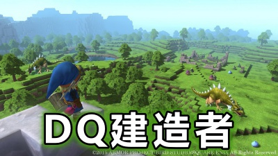
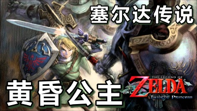
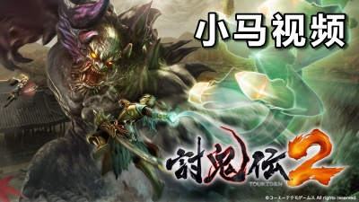

完成特殊Section
==============

## 知识点

* 实现响应式布局
* col-md-*
* order-md-*

参考网页：

https://getbootstrap.com/docs/4.0/

## 实战演习

~~~html
<main>
    <section class="py-5">
        <h2 class="text-center mb-5">小马游戏视频</h2>
        

            

                

                    <h3>勇者斗恶龙建造者</h3>
                    
日本知名游戏厂商SE社正式宣布将面向平台推出《勇者斗恶龙：建造者》游戏，风格为方块建筑RPG。初代《勇者斗恶龙 创造者》于NS上推出，本作2018年春发售。《勇者斗恶龙:建造者》和《勇者斗恶龙:建造者2》的NS版，在西方市场由任天堂发行。

                

                

                    
                

            

            

                

                    <h3>塞尔达传说之黄昏公主</h3>
                    
《塞尔达传说 黄昏公主》（ゼルダの伝说 トワイライトプリンセス，The Legend of Zelda: Twilight Princess）是由任天堂情报开发本部制作、任天堂发行的动作冒险游戏。2006年11月9日首发登陆Wii和NGC，Wii首发作品。双平台合计销量达到885万套以上，是系列目前为止销量最高作。《塞尔达传说：黄昏公主HD》2016年3月10日登陆WiiU平台。

                

                

                    
                

            

            

                

                    <h3>讨鬼传2</h3>
                    
《讨鬼传2》是由KOEI TECMO公司开发的一款动作游戏，于2016年7月28日发行。在吸收了《讨鬼传》优势内容的基础上，增加了诸多提升游戏爽快度的要素。游戏风格也转变成为开放世界形式，且能无缝进入战斗。

                

                

                    
                

            

        

    </section>
</main>
~~~

## 课程文件

https://github.com/komavideo/LearnBootstrap4

## 小马视频频道

http://komavideo.com
